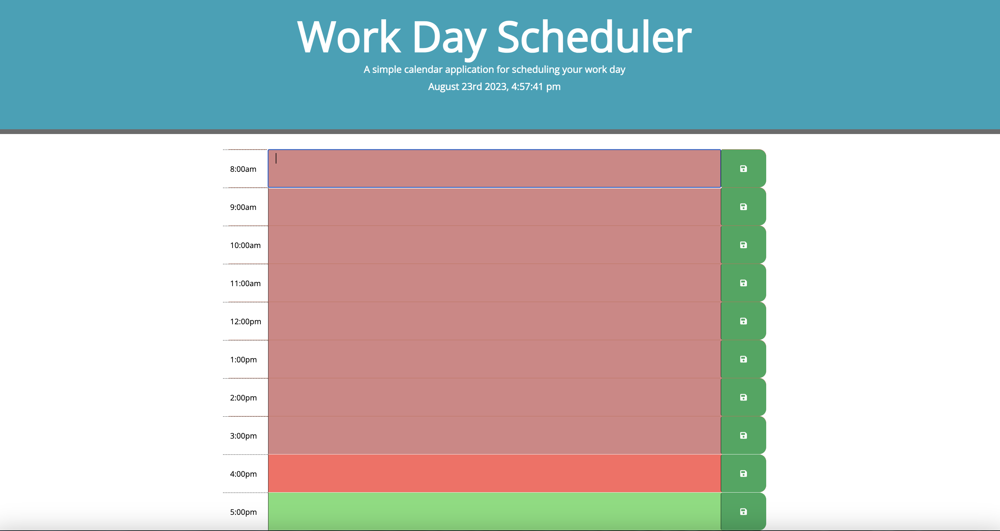
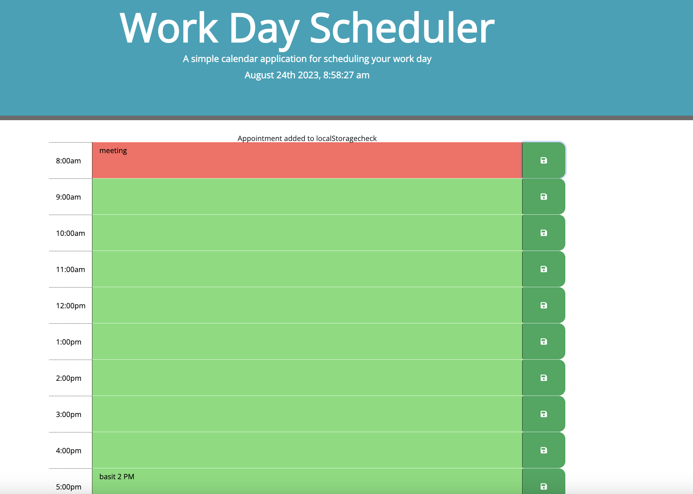

# Work Day Scheduler - Simplified Readme

This is a simple calendar application designed to save hourly events throughout the workday. It's a browser-based app that dynamically updates HTML and CSS using jQuery. The app utilizes the Moment.js library for date and time manipulation.

**App Description:**
This day planner covers 8am to 5pm, reflecting typical working hours for the current day. Users can input and save text for future-hour description fields. Data is stored in the browser's localStorage. Past hours are gray, the present hour is red, and future hours are green.

**Links**
- [Code Repository](https://github.com/basitmalik97/Time-Mark-scheduler)
- [Live Site of Scheduler](https://basitmalik97.github.io/Time-Mark-scheduler/)

**Screenshots**
 

**Pseudo Code Highlights:**
- HTML: Use Bootstrap components, provide timeblocks in both 24-hour and 12-hour formats.
- CSS: Standard setup using HTML attributes and classes.
- JS: Load HTML and CSS, display current day and time using Moment.js, retrieve nearby values, set items in local storage, load saved data from localStorage, and more.

